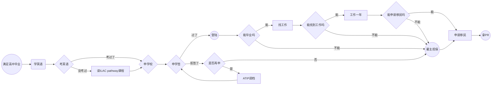

title:  加拿大移民计划mindflow
date: 2023-07-18 19:18:39

-----------------------------
### Mindflow

## 为何优先选择留学移民
不留学就拿身份，你在学术领域的英语水平很差，读写能力也很差。这样的话，你在加拿大的生活会很难受，而且你的工作能力也会受到很大的影响。找工作时因为没有当地的留学背景获得较少的job interview机会。
所以，留学移民是最好的选择。另外，留学移民更方便自己掌控，更容易DIY。

我个人认为是以留学移民方式为优先，雇主担保次之。 雇主担保需要找到合适的雇主，而且雇主也要愿意帮你办理移民，这个比较容易过，但是更贵而且具体情况摸不清，这个过程不由你掌控。

## 补充
这里我并没有提及其他移民方式，因为我从成功率，难易程度上不看好其他方式。

当然，这里我也没在mindflow里描述出可以绕过留学路径直接走雇主担保，这是可以的。但就像前面我所说的，还是建议先走留学方案尝试，失败后再走雇主担保。

这个mindflow中，我并没有详细列出的细节有：
1. 语言成绩多少；
2. 参加哪种类型语言考试；
3. 如何选择合适的学校；
4. 递交学签时的各种资料规范，资金等等；
5. 被拒后的操作；

我觉得这不是mindflow里该说的，等有时间我会详细整理一份blog再描述这些细节。
