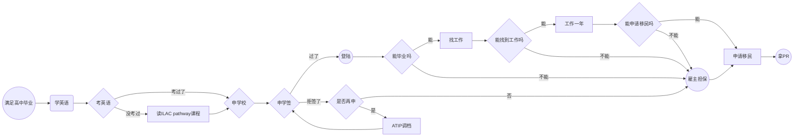

title:  加拿大移民计划mindflow
date: 2023-07-18 19:18:39

-----------------------------
### Mindflow

## 为何优先选择留学移民
不留学就拿身份，你在学术领域的英语水平很差，读写能力也很差。这样的话，你在加拿大的生活会很难受，而且你的工作能力也会受到很大的影响。找工作时也受限于没有当地的留学背景。
所以，留学移民是最好的选择。另外，因为留学移民更方便自己掌控，更容易DIY。

我个人认为是以留学移民方式为优先，雇主担保次之。 雇主担保需要找到合适的雇主，而且雇主也要愿意帮你办理移民，这个比较容易过，但是更贵而且具体情况摸不清，这个过程不由你掌控。

走留学移民的话，需要先找到合适的学校，然后申请学校，然后办理签证，然后去加拿大读书，然后毕业后办理移民。这个过程中，需要考虑的问题有：
1. 语言成绩；
2. 选择合适的学校；
3. 递交学签；
4. 被拒后的操作；

## 补充说明
这里我并没有提及其他移民方式，因为我从成功率，难易程度上不看好其他方式。

当然，这里我也没在mindflow里描述出可以直接走雇主担保，但是是可以的。但就像前面我所说的，还是建议先走留学方案尝试。
